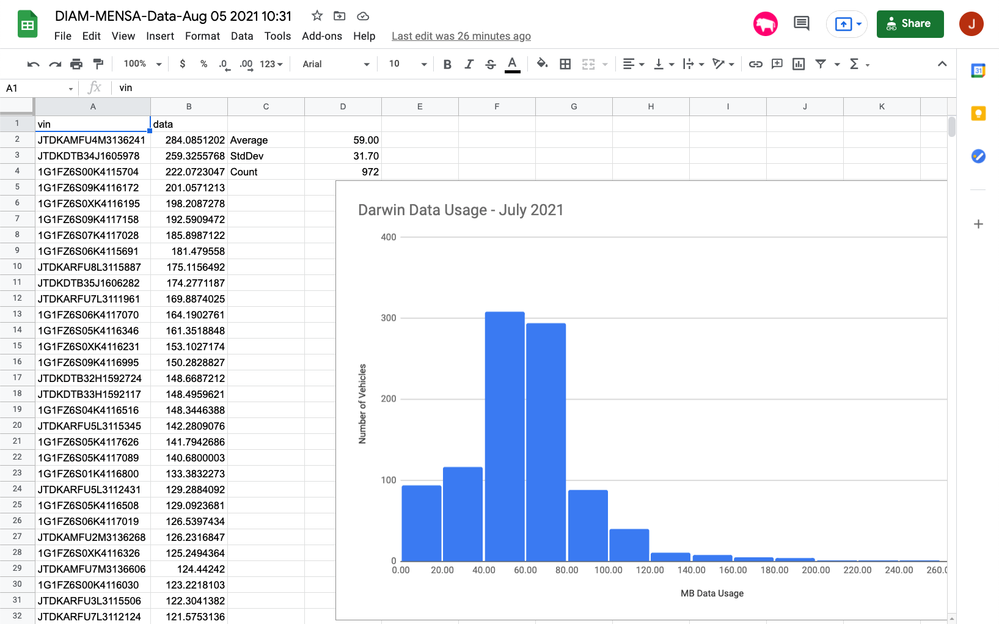
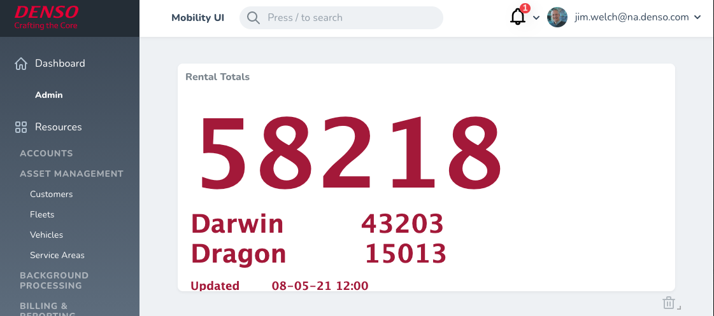

# Support Scripts
> This repo contains some scripts that were developed during different support initiatives. None of them are critical for production and if there is value, the features delivered should be fully integrated into automated builds and existing solutions.

## Monthly Data Usage Tracking

## Dependencies
- AWS credentials properly setup 
- k8s context `prod` setup properly
- Script uses `https://github.com/google/zx` ZX package to allow use of command line and javascript
- Google Sheets credentials. Placeholder is included for `credentials.json` that requires the addition of various parameters that allow edits to an existing Google sheets doc via their API. Service account setup can be accomplished here. `https://console.cloud.google.com/iam-admin/serviceaccounts` (contact Jim for an example if interested)
  
### Installation

```sh
npm install
```

### Usage example

```sh
npm run monthly_data
```

### Local setup

This script has typically been run from a `crontab` entry on a local machine scheduled to execute once a day. To run locally manually:
```
cd scripts
npm install
npm run monthly_data
```

Alternatively:
```sh
crontab -e
....

```

### Release History

* 0.0.1
    * Work in progress

## Daily Rentals Stats
> This script was setup locally via crontab to run each day and total the number of rentals across the different Ridecell fleets. It uses the Datadog API to query for `RENTAL_KEYS_SET` syntheses as a *rough* approximation of revenue rental activity. It was initially created to perform calculations for an internal contest to guess when rentals would reach a certain level. Long term this data would reside within a dedicated Looking Glass dashboard card.

### Automation
Jenkins pipeline has been included to have the rental statistics collected via a `cron` job every 4 hours. This will automate the process and remove the dependency on local execution. The downside is that the statistics page has been moved to a Confluence page and the statistics will no longer be shown in a Looking Glass dashboard panel. Confluence page is here https://diam.atlassian.net/wiki/spaces/MPS/pages/1588723719/Rental+Stats

### Dependencies
- Datadog API keys setup and added to `.env` file
```
DDAPIKEY=<from DD account> 
DDAPPLICATIONKEY=<from DD account>
```

### Installation
```sh
npm install
```
### Usage example

```sh
npm run rentals
```
Results are appended to the file `fleet_stats.json` 
## Meta


